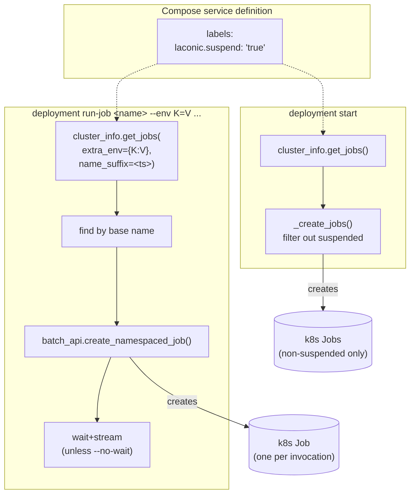

# Job Suspension and Enhanced `run-job` — Design

**Date:** 2026-05-28
**Status:** Draft — pending user review.
**Scope:** k8s deployer (non-helm path). Helm and docker-compose paths
untouched in v1.

---

## 1. Goal

Let stack authors mark individual jobs as "do not auto-run at
`deployment start`" via a compose-level label, and turn the existing
`laconic-so deployment run-job <name>` into a repeatable, observable,
parameterizable trigger suitable for orchestration from ansible
playbooks.

The motivating use case is the `hyperlane-ops` SO stack: a single stack
containing many atomic operator-triggered Jobs (`ism-update`,
`claim-igp-fees`, `close-program`, etc.). Today, `deployment start`
would create them all immediately; instead we want them suspended at
declaration time and triggered one-by-one with per-invocation env vars.

---

## 2. Background — existing behavior

- `stack.yml` `jobs:` lists compose files whose services become k8s
  Jobs. Each compose file produces one Job.
- `deploy_k8s.py::_create_jobs()` is called from
  `start_operation()`. It iterates every parsed job, builds a Job
  object via `cluster_info.get_jobs()`, and creates it via
  `batch_api.create_namespaced_job()`. A 409 on re-run is logged and
  skipped.
- `deploy_k8s.py::run_job()` exists today. The non-helm path also calls
  `cluster_info.get_jobs()`, finds the matching job by name
  (`{app_name}-job-{job_name}`), and creates it. Because the Job name
  is deterministic, calling `run-job` twice without manual cleanup
  fails with 409.
- Per-invocation env vars are not supported on `run-job`.
- No wait/log-stream — `create_namespaced_job` returns immediately
  after the API server accepts the object.

---

## 3. User-visible changes

### 3.1 New compose label: `laconic.suspend`

A job's compose service may set:

```yaml
services:
  ism-update:
    image: ghcr.io/gorbagana-dev/hyperlane-ops:latest
    labels:
      laconic.suspend: "true"
    # volumes, environment, etc. unchanged
```

Semantics:

- Read as a string (compose treats label values as strings). `"true"`
  → suspended. Anything else (including absent) → not suspended.
- A suspended job is **not created** by `_create_jobs()` at
  `deployment start`.
- A suspended job is still produced by `cluster_info.get_jobs()` —
  `run-job` can still find and launch it.

The label sits next to other compose labels and is inert for tools
that don't recognize it.

### 3.2 `run-job` becomes repeatable

Each invocation creates a fresh Job named:

```
{app_name}-job-{job_name}-{unix_timestamp}
```

`unix_timestamp` is seconds-since-epoch at invocation time. This
sidesteps the 409 path entirely; multiple invocations accumulate as
distinct Job objects in the namespace. Per the design decision
(2026-05-28 ops review), no `ttlSecondsAfterFinished` is set — the
operator deletes accumulated Jobs out-of-band.

### 3.3 `run-job --env KEY=VAL` (repeatable)

```
laconic-so deployment --dir <dir> run-job <job_name> \
    --env CHAIN=gorchain \
    --env ADD_VALIDATORS=gorchain-primary \
    --env THRESHOLD=1
```

Each `--env KEY=VAL` becomes a `V1EnvVar` appended to the container's
existing env list (which comes from compose `environment:` + spec
`config:`). The `--env` values **override** any same-named env vars
from earlier sources. Format must be `KEY=VAL` (one `=`); malformed
values fail fast with a clear error before the Job is created.

`--env-file` is **deferred** — out of scope for v1.

### 3.4 `run-job` blocks and streams logs by default

After creating the Job, `run-job`:

1. Polls until exactly one pod exists for the Job (label selector
   `job-name={generated_job_name}`).
2. Waits for that pod to leave `Pending` (or hit `ImagePullBackOff` /
   similar terminal error).
3. Opens a log stream against the pod's container with `follow=True`,
   writes bytes to stdout as they arrive.
4. After the stream ends (pod terminated), reads the Job status; exits
   `0` if `succeeded`, non-zero if `failed`.

`--no-wait` skips steps 1–4: the command returns as soon as the Job
object is accepted by the API server, printing the generated Job name
to stdout.

Timeout: a `--timeout SECONDS` flag (default `0`, meaning no client-side
timeout) bounds the wait. On timeout, the command exits non-zero and
prints the Job name so the operator can investigate; the Job is **not**
deleted (operator decides).

### 3.5 Non-suspended jobs: warn, don't refuse

`run-job` succeeds regardless of the service's `laconic.suspend` value.
If the label is absent or `"false"`, the command prints a warning:

```
WARNING: service 'warp-deployer' is not marked laconic.suspend=true.
Manually running it may race with 'deployment start' auto-creation
if the deployment has not already started.
```

This preserves the existing "rerun a deployer for recovery" use case
without making the foot-gun invisible.

---

## 4. Architecture



`cluster_info.get_jobs()` grows two optional kwargs:

- `extra_env: Dict[str, str]` — appended to each Job's first
  container env list (with override semantics over compose/spec env).
  Default `{}`.
- `name_suffix: Optional[str]` — appended to the Job's metadata name
  as `-{suffix}`. Default `None` (current behavior, deterministic name
  for `_create_jobs()` callers).

The same builder produces both auto-created Jobs (current behavior)
and on-demand Jobs (with suffix + extra env). Single code path.

### 4.1 Filtering in `_create_jobs()`

The filter reads `labels` from the parsed compose service map (the
existing `parsed_job_yaml_map` already preserves it). Pseudocode:

```python
def _is_suspended(parsed_compose: Dict, service_name: str) -> bool:
    svc = parsed_compose.get("services", {}).get(service_name, {})
    labels = svc.get("labels", {}) or {}
    # compose accepts labels as dict OR list-of-strings ("k=v").
    if isinstance(labels, list):
        labels = dict(
            (item.split("=", 1) + [""])[:2]
            for item in labels
            if isinstance(item, str)
        )
    return str(labels.get("laconic.suspend", "")).lower() == "true"
```

`_create_jobs()` skips a job iff `_is_suspended()` returns True. The
service name for a job compose file is the single service inside it
(SO already assumes one service per job compose file).

### 4.2 Wait + log stream

New helper in `deploy_k8s.py`:

```python
def _wait_and_stream(
    self,
    job_name: str,
    timeout_seconds: int,  # 0 = no timeout
) -> int:
    """Block until the Job's pod terminates, streaming logs.
    Returns the desired process exit code (0 on Job succeeded)."""
```

Implementation outline:

1. `w = watch.Watch()`; watch pods filtered by label selector
   `job-name={job_name}` in `self.k8s_namespace`. First event whose
   phase != `Pending` or whose container statuses report a terminal
   waiting reason exits the watch loop. Honor `timeout_seconds`.
2. Open `core_api.read_namespaced_pod_log(name=pod, ...,
   follow=True, _preload_content=False)` — returns a streaming
   response. Iterate `.stream(decode_content=True)` and write each
   chunk to `sys.stdout.buffer` flushing per chunk.
3. After the stream ends, refresh the Job via
   `batch_api.read_namespaced_job_status(job_name, namespace)`. Return
   `0` if `status.succeeded == 1`, else `1`.

The streaming loop is robust to log-stream restarts only insofar as
the existing `tail`/`logs` path is — if the pod crashes the stream
ends and we move on.

### 4.3 Click CLI surface

`stack_orchestrator/deploy/deployment.py::run_job` grows:

```python
@command.command()
@click.argument("job_name")
@click.option("--env", "envs", multiple=True, metavar="KEY=VAL",
              help="Per-invocation env var; repeatable.")
@click.option("--no-wait", is_flag=True, default=False,
              help="Return immediately after Job creation; do not "
                   "stream logs or wait for completion.")
@click.option("--timeout", "timeout_seconds", type=int, default=0,
              help="Seconds to wait before giving up (0 = no timeout). "
                   "Ignored with --no-wait.")
@click.option("--helm-release", ...)  # existing
@click.pass_context
def run_job(ctx, job_name, envs, no_wait, timeout_seconds, helm_release):
    ...
```

`run_job_operation` passes the parsed env dict + `no_wait` +
`timeout_seconds` into `deployer.run_job(...)`. The deployer signature
expands accordingly; existing helm and docker-compose deployers accept
the kwargs but only the k8s non-helm path implements them in v1
(docker-compose: silently ignore + warn if `--env` given; helm: not
supported, raise).

---

## 5. Files affected

### Modified

| File | Change |
|---|---|
| `stack_orchestrator/deploy/k8s/cluster_info.py` | `get_jobs()` accepts `extra_env: Dict[str,str]` and `name_suffix: Optional[str]` kwargs. |
| `stack_orchestrator/deploy/k8s/deploy_k8s.py` | `_create_jobs()` filters suspended; `run_job()` non-helm path uses `name_suffix=str(int(time.time()))` and forwards `extra_env`; adds `_wait_and_stream()` helper, calls it unless `no_wait`. |
| `stack_orchestrator/deploy/deploy.py` | `run_job_operation()` parses `--env K=V`, validates format, forwards `no_wait` + `timeout_seconds`. |
| `stack_orchestrator/deploy/deployment.py` | Click signature for `run_job` (the three new options). |
| `stack_orchestrator/deploy/deployer.py` | Abstract `run_job` signature grows the three kwargs. |
| `stack_orchestrator/deploy/compose/deploy_docker.py` | `run_job` accepts new kwargs; warns and ignores `extra_env`; raises if `no_wait` or `timeout_seconds` are non-default (clearer than silent no-op). |
| `docs/cli.md` | Document the new flags and the label. |

### Added

| File | Purpose |
|---|---|
| `tests/k8s/test_suspended_jobs.py` (or similar) | Unit tests for the suspend filter and the get_jobs kwargs. |

No file deletions.

---

## 6. Compatibility

- Existing job compose files have no `laconic.suspend` label → not
  filtered → identical behavior at `deployment start`. No migration.
- Existing `run-job` callers that don't pass `--env`/`--no-wait`
  /`--timeout` get the new behavior: a fresh timestamp-suffixed Job
  and a blocking stream. **This is a behavior change** — previously
  `run-job` returned immediately. Acceptable because the existing
  command is only used by one or two stacks in practice and the new
  behavior is strictly more useful; documented in the cli docs.
- Helm path: untouched. `--env` raises with a clear "not supported on
  helm deployments in v1" message.

---

## 7. Verification

### Unit

- `cluster_info.get_jobs(extra_env={"X":"1"}, name_suffix="42")`
  produces a Job whose container env contains `X=1` and whose
  metadata.name ends in `-42`.
- `_is_suspended` returns True for dict form, list form, mixed-case
  `"True"`, and False for absent/`"false"`/other values.

### Integration (in `hyperlane-stacks` E2E once landed)

- A stack with one suspended and one non-suspended job: `deployment
  start` creates only the non-suspended one.
- `run-job <suspended>` creates a fresh Job each invocation; two
  back-to-back calls produce two Job objects with different
  timestamp suffixes; both run to completion.
- `run-job <suspended> --env FOO=bar` results in `FOO=bar` visible in
  the pod's env (verified via `kubectl exec` or log output).
- `run-job <non-suspended>` prints a warning to stderr and still
  succeeds.
- `run-job --no-wait` returns within ~1s, before the pod completes.
- `run-job --timeout 5` against a deliberately long-running Job
  exits non-zero after ~5s and leaves the Job intact.

---

## 8. Out of scope (v1.x or later)

- `--env-file` flag.
- `deployment prune-jobs` cleanup helper / TTL defaults.
- Per-deployment override of the suspend label from the spec.
- Helm path support for `--env`.
- docker-compose path support for `--env` / streaming wait (jobs in
  docker-compose are not a first-class concept the same way).
- Concurrency control between multiple parallel `run-job` invocations
  of the same job — k8s timestamps already make Job names unique;
  serializing is the operator's responsibility.

---

## 9. Open questions

None as of writing. All architectural questions settled in the
2026-05-28 brainstorm:

1. Suspend lives in compose `labels:` (per-service, per-job).
2. Per-invocation env via `--env KEY=VAL` repeatable; no `--env-file`.
3. No TTL — operator cleans up.
4. Block + stream logs by default; `--no-wait` opts out.
5. Label key is `laconic.suspend: "true"` under compose `labels:`.
6. `run-job` runs any job, warns when not suspended.
